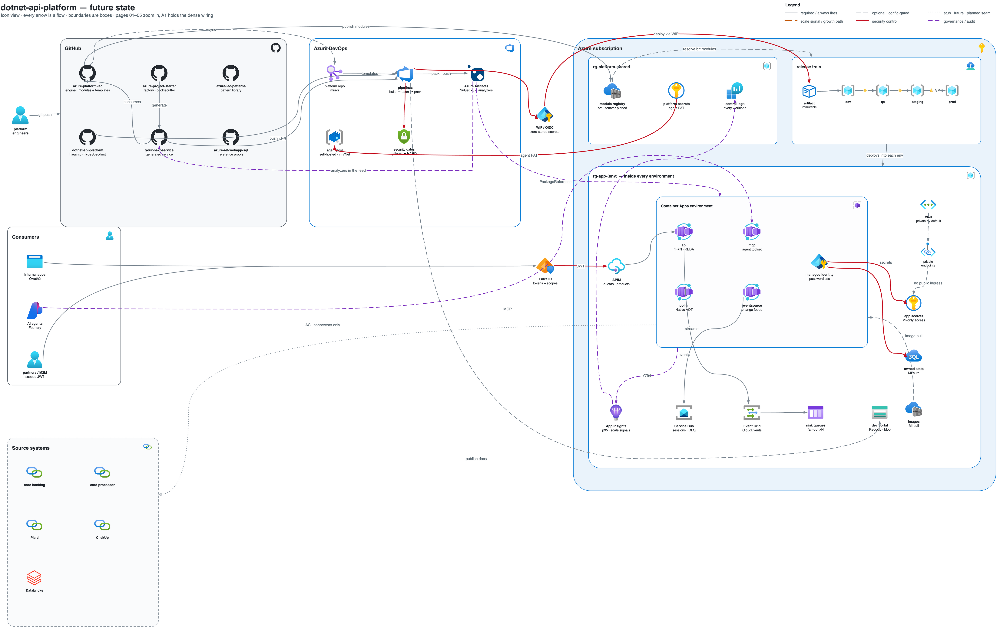

# dotnet-api-platform

A reference API platform for a financial institution on an Azure + .NET stack — consistent,
secured, auditable, and structured so agents and developers can add resources to house
standards with machine-verified conformance, no human style gate.

> Public reference implementation. The institution (**Northwind Credit Union**) and source
> systems ("Core Banking", "Loan Origination", "Data Warehouse") are fictional placeholders.

The central idea: every governance rule is a machine check — five Roslyn analyzers, a
banned-API rule, NetArchTest architecture facts, a drift gate, and a sanitize gate. A change
that violates one of them fails the build or the test suite before review.



The diagram above is the future-state system at a glance. Six more pages zoom into each
zone — all live in one editable [draw.io file](docs/diagram/dotnet-api-platform-architecture.drawio)
(plus a [PDF](docs/diagram/dotnet-api-platform-architecture.pdf)):

| Page | View |
|------|------|
| [00 · Future State](docs/diagram/page-00-future-state.png) | the whole system, icon view |
| [01 · Ecosystem](docs/diagram/page-01-ecosystem.png) | the platform-repo cascade across GitHub, Azure DevOps, and Azure |
| [02 · Runtime](docs/diagram/page-02-runtime.png) | the modular monolith on Container Apps |
| [03 · The Guards](docs/diagram/page-03-guards.png) | every control that fires on one API call, in order |
| [04 · Contract-first & CI/CD](docs/diagram/page-04-contract-cicd.png) | TypeSpec → drift gate → pipeline |
| [05 · Scaling Ladder](docs/diagram/page-05-scaling.png) | rungs 0–6 with explicit climb signals |
| [A1 · Dense wiring](docs/diagram/page-A1-dense-wiring.png) | everything on one canvas, fully labeled |

The diagrams are generated — edit [`docs/diagram/gen.py`](docs/diagram/gen.py) and re-run
rather than editing the XML (see [docs/diagram/README.md](docs/diagram/README.md)).

See **[ARCHITECTURE.md](ARCHITECTURE.md)** for the full design and
**[docs/PROMPT-TRANSCRIPT.md](docs/PROMPT-TRANSCRIPT.md)** for how this repo was built.

## Build

```bash
dotnet build src/ApiPlatform.slnx -c Release
```

The solution (`src/ApiPlatform.slnx`) contains 12 source projects and 5 test projects. A
bare `dotnet build` from the repo root will fail; always target the solution file.

## Test

```bash
dotnet test src/ApiPlatform.slnx -c Release
```

## Run

The default auth mode is `Header` — a development-only scheme that reads scopes from an
`X-Scopes` header, no token required:

```bash
dotnet run --project src/ApiPlatform.Api

# reach accounts without a token:
curl -H "X-Scopes: account.read" http://localhost:5017/v1/accounts
```

To run with enforced JWT auth and no cloud dependency, use `LocalJwt` mode:

```bash
AUTH_MODE=LocalJwt dotnet run --project src/ApiPlatform.Api
```

In the `Development` environment (the default for `dotnet run`), `LocalJwt` mode falls back
to the committed non-secret dev key (`LocalDevJwt.DefaultDevKey`) and logs a startup warning.
In any non-Development environment, `AUTH_MODE=LocalJwt` with no `AUTH_SIGNING_KEY` refuses to
start — the process throws at composition rather than silently allowing all requests.

Mint signed tokens for `LocalJwt` mode with `LocalDevJwt.Mint()` in
`ApiPlatform.Platform.AspNetCore.Auth`. Pass the key, issuer (`api-platform-local`), audience
(`api-platform-local`), and the scopes you want. The test suite in
`tests/ApiPlatform.Tests/LocalJwtAuthTests.cs` shows the full pattern.

```bash
# LocalJwt mode — pass a minted token:
curl -H "Authorization: Bearer <token>" http://localhost:5017/v1/accounts
```

## Guardrails

The platform enforces several guarantees at the build or test level. A change that violates
one of them does not compile or does not pass the test suite.

**Bypassing the governed data seam (APL0001, RS0030).**
Every canonical source interface (`IAccountSource`, `ICustomerSource`, etc.) extends
`IGovernedSource`. Registering one outside an `IConnectorModule.Register` block, or opening
`HttpClient` / `SqlConnection` / `DbContext` outside `ApiPlatform.Integration`, is a build
error. The DynamicProxy audit interceptor wraps every governed seam at registration;
bypassing the seam means bypassing audit and PII masking.

**Reading wall-clock time directly (APL0003).**
`DateTime.Now`, `DateTime.UtcNow`, `DateTimeOffset.Now`, and `DateTimeOffset.UtcNow` are
banned in platform code — build error. Inject `TimeProvider` and call `GetUtcNow()`.

**Writing to the console (APL0004).**
`Console.Write*` is banned — build error. All diagnostic output goes through `ILogger` so
it carries correlation IDs and reaches the configured sinks.

**Missing an RFC 9457 type URI on a problem response (APL0005).**
Every `TypedResults.Problem(...)` call must pass a `type:` URI from `ProblemTypes.*`. Omitting
it is a build error. Consumers must be able to classify errors machine-side without
string-matching titles.

**Hiding a connector module (APL0002).**
An `IConnectorModule` that is not `public` is silently never discovered by the connector
registry. That footgun is a build error.

**Leaking an upstream outage as a wrong HTTP status.**
Vendor failures propagate through `Result<T>` / `UpstreamOutcome` and surface at the HTTP
edge via `UpstreamExceptionHandler`, which maps them to 502 (vendor error) or 503
(transient / retryable) with a canonical RFC 9457 problem response. A vendor outage never
surfaces as a 404, an empty body, or a generic 500.

## Deploy (Azure Container Apps, scale-to-zero)

```bash
make up       # RG + platform: ACR, Container Apps env, Log Analytics + App Insights, portal
make deploy   # build image in ACR → create/blue-green-update the app (revisions + traffic split)
make portal   # build the catalog → Blob static website
make url      # the live URL
make down     # delete everything (~$0 at rest anyway)
```

## Sanitize gate

`make sanitize` runs a two-layer publish gate before any file leaves this repo:

**Layer 1 — committed structural patterns (runs in CI and locally):**
Generic shape-based regexes with no proper nouns: account-number shapes, SSN shapes,
VIN-shaped tokens, and host:port service-account shapes. These are the CI backstop — they
run on every push and pull request as a hard-failing workflow gate.

**Layer 2 — local literal denylist (never committed; not present in CI):**
A `sanitize-denylist.private.txt` file in the repo root holds real institution, vendor, and
employer-name literals. The file is covered by `.gitignore` (`*.private.txt`) and is never
staged or pushed. When present locally, `make sanitize` loads it automatically alongside the
structural patterns. CI runs without it by design — the Layer-1 patterns are the durable
backstop.

To add private terms locally: create `sanitize-denylist.private.txt` (one PCRE pattern per
line, `#` comments supported). Never commit it.

```bash
make sanitize   # structural patterns always; private denylist if present
```
